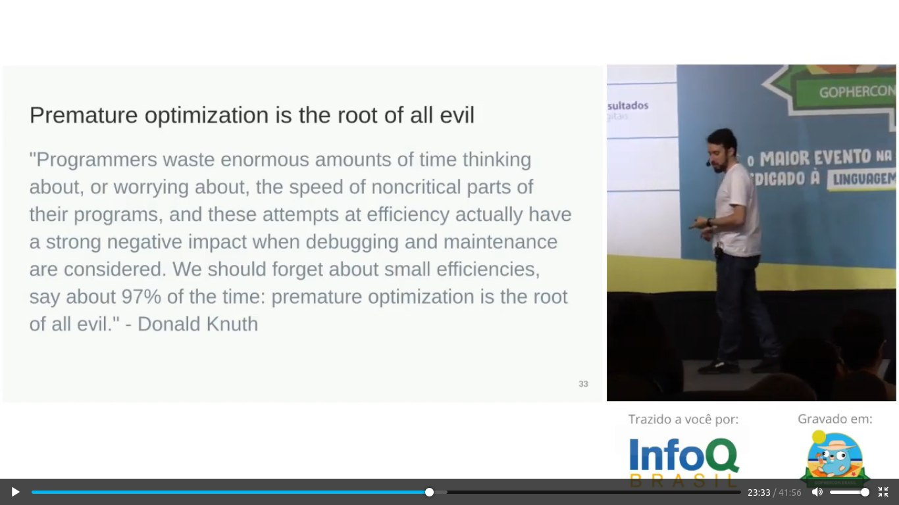

# GOPHERCON BRASIL 2019

## Otimização e Performance em Go: fomos longe demais?

https://www.infoq.com/br/presentations/otimizacao-performance-em-go/

- Measure twice, cut once.
- Premature optimization is the root of all evil - Donald Knuth

- Latency at a human scale: [Font]( https://www.prowesscorp.com/computer-latency-at-a-human-scale/)

|System Event|Actual Latency|Scaled Latency|
|------|---|----|------|
|One CPU cycle|0.4 ns|1 s|
|Level 1 cache access|0.9 ns|2 s|
|Level 2 cache access|2.8 ns|7 s|
|Level 3 cache access|28 ns|1 min|
|Main memory access (DDR DIMM)|~100 ns|4 min|
|Intel® Optane™ DC persistent memory access|~350 ns|15 min|
|Intel® Optane™ DC SSD I/O|<10 μs|7 hrs|
|NVMe SSD I/O|~25 μs|17 hrs|
|SSD I/O|50–150 μs|1.5–4 days|
|Rotational disk I/O|1–10 ms|1–9 months|
|Internet call: San Francisco to New York City|65 ms[3]|5 years|
|Internet call: San Francisco to Hong Kong|141 ms[3]|11 years|

- **Livro para performance em Go de dgryski**: [go-perfbook](https://github.com/dgryski/go-perfbook)

- **Ferramentas para medição**:
  - Pprof: lib nativade go blog.golang.org/profiling-go-programs
  - Flame graphs (Incluso no pprof)
  - Benchmark(igual teste unitário)
  - benchcmp
  - benchstat

- **Referências**:
  - youtube: tracing Rhys Hiltner gophercon 2017
