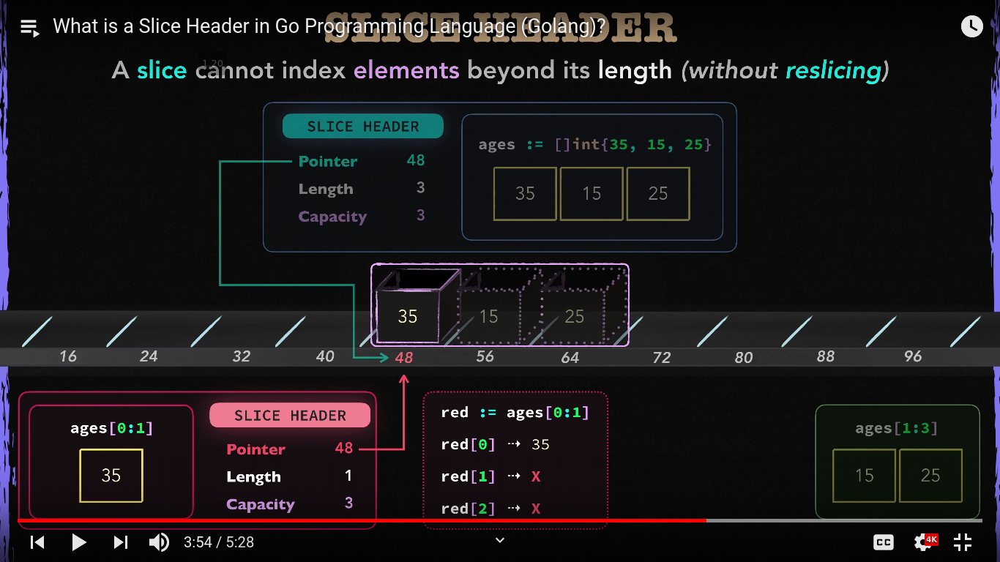
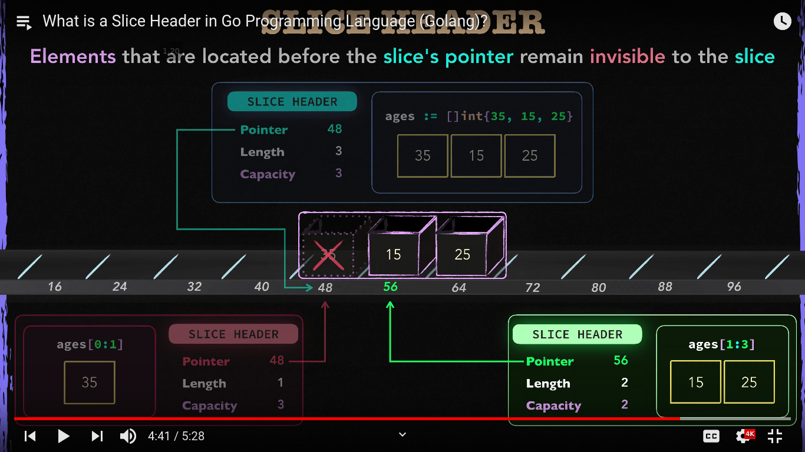

# Learning Go Programming (Youtube channel)

## Idiomatic Go Naming Conventions

https://youtu.be/yQUAHpEvb9A?list=WL

> Avoid unnecessary verbose method. Im small scope use abreviations and complete words in larger scopes.

```go
package main

var FileClosed bool

func Read(b *Buffer, a []byte) (n int, err error) {
    ...
}
```

|abreviations|
|--------|
|args    |
|arr     |
|dst     |
|err     |
|i       |
|idx     |
|msg     |
|num     |
|src     |
|str     |

Remember: **Readability equals maintainability**

## Configure VS Code

https://youtu.be/NphW8lvJ_fg?list=WL

## Slice Header

https://youtu.be/fF68HELl78E?list=WL

Screenshots:




## OOP: Interface

https://youtu.be/qJKQZKGZgf0?list=WL

> "Bigger the interface th weaker the abstraction." - Rob Pike

```go
type product interface {
    print()
}

type book struct {
    Name string
}

func (b book) print() { fmt.Println("Book\t", b.Name) }

type game struct {
    Name string
}

func (g game) print() { fmt.Println("Game\t", g.Name) }

func main() {
    stock := []product{
        book{"Moby Dick"},
        game{"GTA"},
    }

    for _, ii := range stock {
        ii.print()
    }
}
```

out:

```sh
Book     Moby Dick
Game     GTA
```
